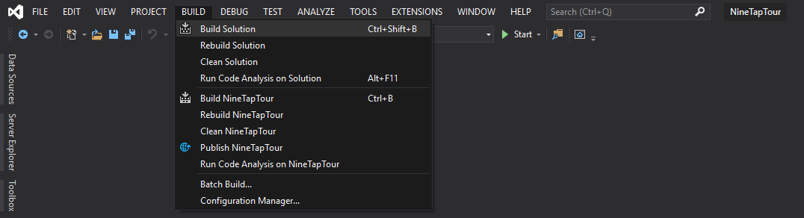
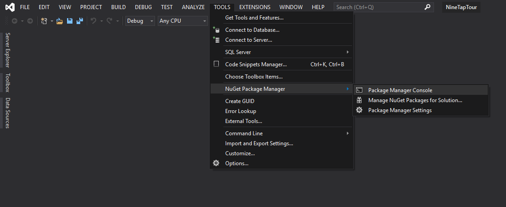
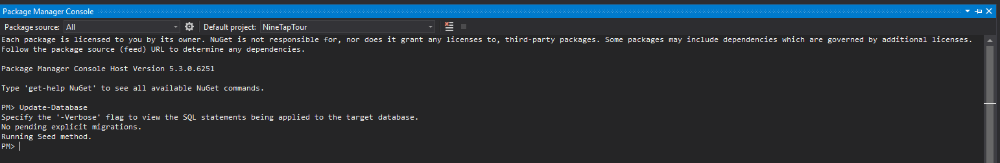
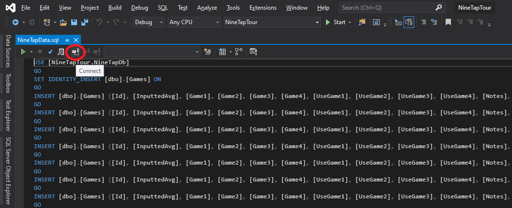
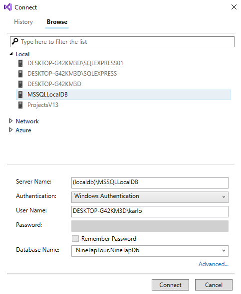
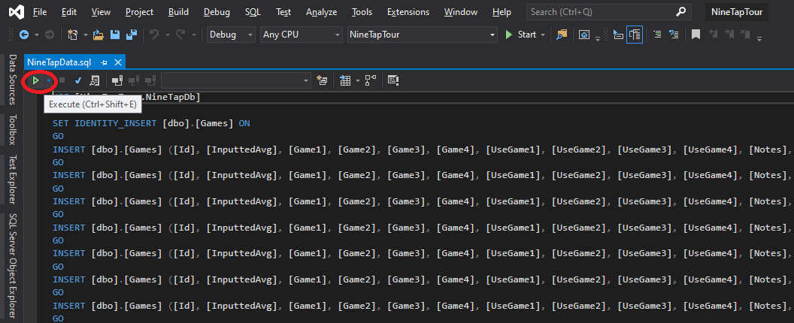

# 9-Tap Tour
This app is the 9-Tap Tour Replacement Application, that keeps track of the 9 Tap Tour. This information includes member data, tournament information, games, monies earned, player stats etc. The app will replace the current program being used by the client to run future 9-Tap tournaments.

## Getting Started
To get started with this project please review the following and reference the [project Wiki](https://github.com/CPTC-CPW/9TapTour/wiki) for things not listed here.

To get started with using 9TapTour and successfully running the database and getting test data, refer to this youtube video. Please refer to the description when you get to using SQL Server Management Studio.

* [9TapTour - Installing Database and Test Data](https://www.youtube.com/watch?v=CgwC94uQqxA)

## Getting Started With 9TapTour Step-By-Step Instructions
- **Note** This is for those who have added the project to a computer without an exsisting copy of 9TapTour and/or the database.
- We are using Visual Studio 2019 and SQL Server Management Studio in this Example. This will also work using Visual Studio 2017.

1. After cloning 9-Tap Tour make sure that you build the solution to get all dependencies from the project.

2. In VS2019 Go to Tools -> NuGet Package Manager -> Package Manager Console.

3. In the Package Manager Console Enter `Update-Database` and Run it.

**Very Important:** Do NOT run the application with an empty database. You must follow and complete the instructions below before doing so. Disregarding these instructions, will cause the test data to not properly display when the application is ran. Running the application with an empty database creates a new region, and since all of the test data was in a different region, the application will never display the test data.

## Populating the database with test data:
1. Once you have updated your database go to your Solution Explorer - > Database -> DBScripts. Then double click the NineTapData.sql file, which opens the script.

2. On the top left hand side of the window (circled in red), is the connect button. This will be used to select which database the script will connect to.

3. Once you have clicked the icon, it should bring up a connect window. Before clicking the connect button, click the dropdown for local, select MSSQLLocalDB, and make sure your settings are as follows:
    * Server Name: (localdb)\MSSQLLocalDB
    * Authentication: Windows Authentication
    * User Name: This field should already be populated
    * Database Name: NineTapTour.NineTapDb
    

4. Once it's connected, click the green play button at the top left hand side of the screen (circled in red). It should exececute the query. It may take a minute or so to complete. 

5. Upon completion, your databaase should have all the necessary test data, and you are safe to run the application.

### Prerequisites
The current build is being built on Windows machines through Visual Studio 2017 v.15 or greater.
Using SQL Server Management Studio to run SQL Scripts.

* [Download Visual Studio Here](https://visualstudio.microsoft.com/downloads/)
* [Download SQL Server Management Studio Here](https://docs.microsoft.com/en-us/sql/ssms/download-sql-server-management-studio-ssms?view=sql-server-2017)

### Coding Style Requirements
Reference the [code style requirements Wiki](https://github.com/CPTC-CPW/9TapTour/wiki/Coding-Style-Requirements) for more information.

## Built With
* [Visual Studio](https://visualstudio.microsoft.com/) - Program Used for Design

## Authors 
Reference the list of [contributors](https://github.com/CPTC-CPW/9TapTour/graphs/contributors) who participated in this project.

## License 
9-Tap Tour's [License Agreement](https://github.com/CPTC-CPW/9TapTour/wiki/License-Agreement) Wiki.
